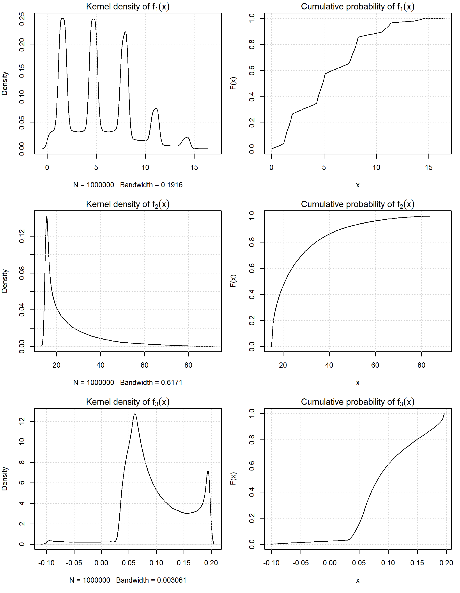
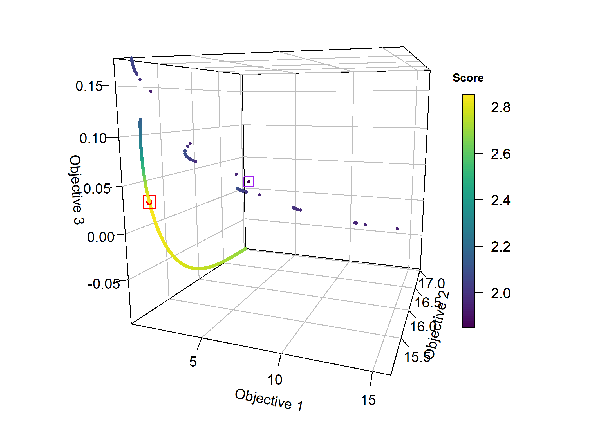
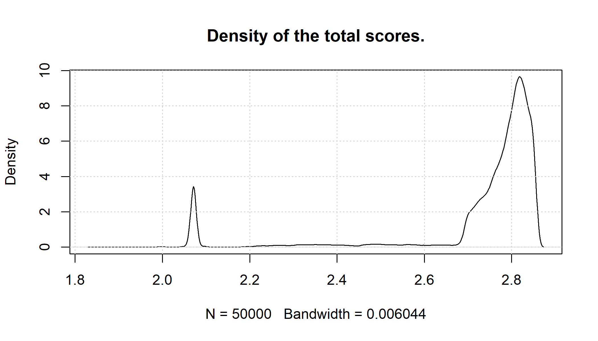
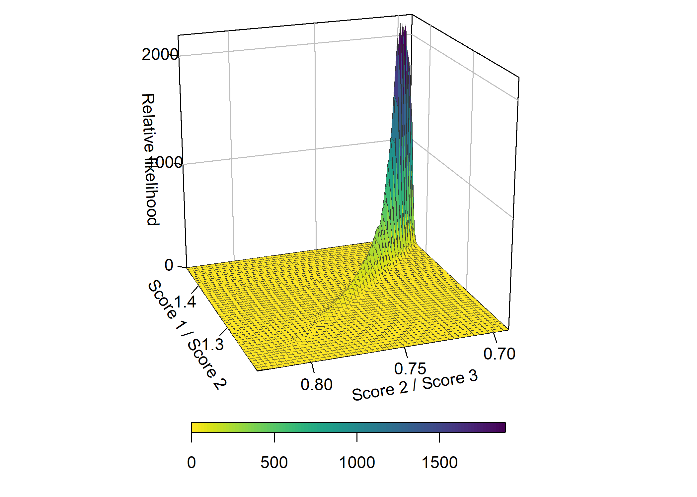

-   <a href="#introduction" id="toc-introduction">Introduction</a>
-   <a href="#transformation-to-scores"
    id="toc-transformation-to-scores">Transformation to scores</a>
    -   <a href="#ordering-of-solutions" id="toc-ordering-of-solutions">Ordering
        of solutions</a>
    -   <a href="#obtaining-desired-trade-offs"
        id="toc-obtaining-desired-trade-offs">Obtaining desired trade-offs</a>
-   <a href="#the-viennet-function" id="toc-the-viennet-function">The
    Viennet function</a>
    -   <a href="#high-precision-operatornameecdfs"
        id="toc-high-precision-operatornameecdfs">High-precision ECDF s</a>
    -   <a href="#trade-offs" id="toc-trade-offs">Trade-offs</a>
-   <a href="#results" id="toc-results">Results</a>
    -   <a href="#ordering-the-solutions"
        id="toc-ordering-the-solutions">Ordering the solutions</a>
    -   <a href="#obtaining-desired-trade-offs-1"
        id="toc-obtaining-desired-trade-offs-1">Obtaining desired trade-offs</a>
        -   <a href="#a-priori-correction-of-weights"
            id="toc-a-priori-correction-of-weights">A priori correction of
            weights</a>
        -   <a href="#online-correction" id="toc-online-correction">Online
            correction</a>
    -   <a href="#examining-possible-trade-offs"
        id="toc-examining-possible-trade-offs">Examining possible trade-offs</a>
-   <a href="#references" id="toc-references">References</a>

# Introduction

Solving multi-objective optimization problems (MOOPs, ) are problems of
two or more conflicting problems (or objectives).

The goal is to find some **x**⋆ in the *decision space* 𝒟
that minimizes the loss across all single objectives simultaneously.
Their solving may lead to a (possibly infinitely) large solution space
𝒮. Each vector **s***i* in this space holds a solution for
each of the optimized objectives. The set of Pareto *efficient*
solutions comprises those solutions that cannot be further improved.
Because vectors in the Pareto efficient solution space cannot be ordered
completely ([Miettinen 2008](#ref-miettinen2008)), they are
traditionally regarded as equally desirable (in the mathematical sense,
that is). A decision maker (DM) is then consulted to pick a preferred
solution. Even worse, it may not be trivial to pick some most preferred
solution, as the role of the chosen weights is misleading ([Roy and
Mousseau 1996](#ref-roy1996theoretical)). The mathematical sense is,
however, not congruent with interpreting objectives as scores. While in
some cases objectives can be scaled into some uniform, dimensionless
scale, the distribution of their associated losses remains unknown and
**must** be assumed to be non-uniform. In other words, not each
attainable loss is equally likely, which drastically exacerbates the DMs
situation of having to pick *and* actually obtain the desired trade-off.

We demonstrate an approach to approximating the order of Pareto
efficient solutions, based on the marginal distributions of each
objective. This approach transforms each objective into a score with
standard uniform distribution, which allows comparing solution vectors.
Used as either an a priori or a posteriori method, we can show that
obtaining efficient solutions significantly closer to the desired
trade-off is possible, using two distinct methods. The first method
significantly improves precision by replacing the raw objectives with
their scores during optimization. The second method improves the
precision even more drastically, but requires the computation of some
Pareto efficient solutions, in order to learn the non-linear mapping
between preferences and solutions in the score space. None of the
methods require the objectives to be scaled or having to know or
approximate nadir-, ideal-, or utopian-vectors. Furthermore, by mapping
objectives to scores, it allows a DM to gain insights into the density
and homegenuity of the solution space, as well as to understand which
trade-offs are actually possible. We use the Viennet function ([Viennet,
Fonteix, and Marc 1996](#ref-viennet1996)) to empirically gather some
results.

# Transformation to scores

Given some objective *f* : ℝ*m* → ℝ that is subjected to
minimization, we approximate its empirical distribution by uniformly
drawing vectors **x** ∈ ℝ*m* from the decision space 𝒟. We
therefore treat the outcome of each objective as a random variable that
follows some distribution 𝒳 ∼ **β**, where the parameters **β** are
unknown. Any random variable can be transformed into another random
variable with standard uniform (or arbitrary other) distribution, using
the *probability integral transform*. For our purposes, the standard
uniform distribution suffices, as its range is \[0,1\], which
corresponds to what one would expect from a score. The cumulative
distribution CDF  of a random variable expresses the probability to find
a value less than or equal to *x*. The results of the objective are
ordered, and so is its corresponding CDF . However, the meaning of loss
and score is still reversed, in that a low loss corresponds to a low
chance of observing it. We therefore define the score for *f* as in ,

where the operation 1 − CDF (*x*) = CCDF (*x*) is the *complementary*
CDF . Now, a low loss of *f* will yield a high score for
*S**f*, and vice versa. Throughout this work we use empirical
CDF s approximated with high precision (using 106 random
decision vectors), in order to map from the loss- into the score-space.
This is done to achieve high numerical precision in the context of this
work. As we will show, in practice it suffices to draw considerably
fewer samples (e.g., 103) to obtain a sufficient
approximation.

## Ordering of solutions

Orderability of Pareto efficient solutions is something that has eluded
multi-objective optimization. In practice, the DM was only left with the
mathematical equal desirability. Using CCDF s, obtained solutions can be
mapped into the score space 𝒮. Using some final scheme that expresses
the weight or importance of each score for some absolute best solution,
the obtained scores for each solution can be aggregated, and the space
be ordered according to that. The result of this may or may not be a
unique solution.

## Obtaining desired trade-offs

While preference may be expressed, it is not necessarily adhered to,
neither by the solution algorithm, nor by the problem itself. When
specifying preference, a DM might obtain a solution close to that
preference. However, that solution is in the objective space 𝒪,
***not*** in the score space 𝒮. The latter is perhaps the only space
workable for human DMs. This means that so far, expressing preference
with non-uniformly distributed objectives has never led to the desired
solution.

In order to obtain a trade-off close to the desired trade-off, we
identify two methods. In the first method, the solution algorithm would
solve a version of the original problem, but based on the scores . Since
we have a one-to-one association between preference and score, this
method ought to converge towards the desired trade-off more accurately.
This method usually requires a somewhat better empirical approximation
of the marginal cumulative densities, or some well-fitting parametric
probability distribution. In the former case, measures for introducing
smoothness into the empirical CDF s have to be taken as otherwise, the
gradient of the problem will be zero, making this method only applicable
in gradient-free scenarios. This method also enables the simple
weighting method and the method of *weighted metrics* (or compromise
programming) ([Zeleny 1973](#ref-zeleny1973compromise)). The weighting
methods require their objectives to have the same range, which we will
get by using CDF s. This is an important point, as by sufficiently
approximating those, we do not have to approximate the nadir-, ideal-,
or utopian-vectors, which are otherwise required for proper scaling.
Especially the nadir-vector is difficult to obtain in practice
([Miettinen 2008](#ref-miettinen2008)), so not requiring precise
approximations of any of those vectors means we can dispense with the
associated effort, and may also be able to use previously incompatible
solution algorithms.

In the second method, we attempt to “rectify” the preference as
expressed by the DM. As we have previously established, there does not
exist a linear relation between some preference and its solution in the
score space. We can however approximate that non-linear relationship,
too. By uniform randomly sampling from the *preference space* 𝒫, we
first compute a sufficiently large subset of the Pareto optimal set in
the score space. Typically, this set is considerably smaller than the
full set . These solutions are computed to establish a bijection 𝒫 → 𝒮
between the spaces for the desired- and obtained trade-off (i.e., which
preference leads to which trade-off in the score space). Then, this
relation is reversed and some model is fit that minimizes the deviation.

This can be done as we now have a one-to-one correspondence between
preferences and solutions in the score space. The DM is now enabled to
express their preference, and the learned model corrects this preference
in order to converge to an efficient solution close to the desired
trade-off.

# The Viennet function

The Viennet function consists of three objectives, each of which takes
the same two parameters **x** = {*x*1, *x*2}. It
is defined as in ([Viennet, Fonteix, and Marc 1996](#ref-viennet1996)).
The box bounds for the decision space 𝒟 for this problem are sometimes
limited to  − 3 ≤ *x*1, *x*2 ≤ 3, but there is no
practical difference using the slightly larger bounds as we do.

Figure shows the Pareto front of the efficient set. In order to obtain
the front, we compute 50, 000 solutions by drawing preference
constellations uniform randomly from the preference space 𝒫. It is
obvious that the three objectives do not share a common domain. The
starting point for each optimization is chosen deterministic randomly,
within the box bounds of the decision space 𝒟. As solution algorithm we
use the derivative-free global optimization called “DIRECT-L”. It is
based on a systematic subdivision of the search domain into increasingly
smaller becoming hyperrectangles ([Gablonsky and Kelley
2001](#ref-gablonskyK2001)). The scalarizer used is the simple weighting
method. While it has deficiencies, it can find Pareto efficient
solutions if all weights are  \> 0. The weighting method requires all
objectives to share some common uniform dimensionless scale, which is
fulfilled when using scores instead of raw objectives. With the global
optimization we ascertain that the method will work even if this
situation is not given.

## High-precision ECDF s

In order to check the validity and precision of the results obtained in
this work, we obtain 106 samples from each objective using
random decision vectors. These are shown in figure . Clearly, all of the
distributions are non-uniform and different from each other.

## Trade-offs

Similar to the high-precision ECDF s, a priori knowledge about possible
trade-offs does usually not exist, except for when the Pareto efficient
set has been computed. Requesting an *infeasible* preference will still
lead to an efficient solution, but perhaps not the desired one, either
because it does not exist or it cannot be found. This implies that there
is some non-linear mapping between the set of infeasible preferences and
associated trade-offs. Ergo, we can split the preference space 𝒫 into
the sets of feasible and infeasible trade-offs, denoted by 𝒫⋆
and 𝒫†, respectively. If there was access to 𝒫⋆,
one could learn about whether some preference **p**⋆ leads to
the desired trade-off decision vector **s** in the score space. For
example, the relationship might be linear.

# Results

In this section, we demonstrate some of the empirical findings.

## Ordering the solutions

In order to introduce order into the set of previously computed Pareto
efficient solutions, we first map each solution into the score space and
then simply sum up its scores in an unweighted manner, making no
additional assumptions about which objective is the most important.

The total scores for each of the solutions are in the interval
\[≈1.848,≈2.856\]. This means that any solution with arbitrary
combination of scores less than  ≈ 1.848 is not Pareto efficient. There
is a unique best solution for this problem with objective values of
{*f*1≈0.9231,*f*2≈15.1532,*f*3≈0.0307},
marked by a red square in figure . The solution marked by the purple
square is the worst in the Pareto efficient set. A lighter color in this
figure indicates a higher total score. The distribution of the total
scores is then shown in figure . In our case, the space containing the
highest-scoring solutions is continuous and contiguous, i.e., the Pareto
efficient solutions are to be found in a single area, and there is no
area disjoint from that which has high scores, too.

## Obtaining desired trade-offs

Obtaining a Pareto efficient solution close to the desired trade-off can
be done in multiple ways, all of which require to map the solutions into
the score space 𝒮.

### A priori correction of weights

In the first method, we attempt to correct the DMs preference such that
it will result in the desired trade-off. This method requires us to
learn a non-linear mapping between the gotten and desired trade-off
(𝒮 → 𝒫). This means that some DM expresses their preference in the
solution space, which feels more natural. The complexity of choosing
appropriate weights for the desired solution is then delegated to this
method. This method does not require to have a notion of whether some
expressed preference is feasible. If, however, there is knowledge about
𝒫⋆ or 𝒫†, and the mapping 𝒫⋆ → 𝒮 is
known to be linear, then those preference/solution tuples can be
excluded from training. In order to obtain training data for a model, we
require a random subset of the Pareto efficient solutions to learn from.
From the previously approximated Pareto front that holds 50, 000
efficient solutions, we take now 2, 500 for this task. The remaining
47, 500 pairs are held out as validation data and are not in any way
part of the training. To simplify the data, we normalize each solution-
and preference-vector such that the most preferred objective has a
weight of 1. We attempt to learn an artificial neural network ([Fritsch,
Guenther, and Wright 2019](#ref-rpgk_neuralnet)). It is shown in figure
. Since the problem is relatively small, we settle for a single hidden
layer with five units. The Sigmoid function is used as activation
function. From that figure we see that the preference is now actually
specified in the solution space 𝒮, and that the network will predict the
associated preference in the preference space, 𝒫.

Figure shows a significant improvement of the obtained trade-offs using
a corrected preference. We also generate some quantiles (see table ).
While still not perfect, 50% of all trade-offs show a mean absolute
error of  ≈ 0.129. We also obtain much less extreme deviations, and no
deviation is larger than  ≈ 0.679.

### Online correction

The method of correcting preference seems promising. However, we also
want to examine the approach of using scores instead of raw objectives
during optimization. If we examine the empirical densities of figure ,
it does not appear that we can fit parametric distributions with
promising results. We therefore approximate empirical CDF s using 2, 500
random decision vectors for each objective. While the ECDF  is a step
function, we introduce numerical stability and strict monotonicity by
first replacing the step-wise function with a piece-wise linear
function. Then, we add slight slopes to the begin and end of each
function, to account for extreme values not observed so far. This is
conceptually similar to how the utopian vector is created:
**z**⋆⋆= **z**⋆ − *ϵ*.

| Quantile | org     | corr    | online  |
|:---------|:--------|:--------|:--------|
| 0%       | 0.00097 | 0.00014 | 0.0022  |
| 10%      | 0.22227 | 0.02509 | 0.12085 |
| 20%      | 0.3299  | 0.0466  | 0.17645 |
| 30%      | 0.41604 | 0.0702  | 0.21976 |
| 40%      | 0.48882 | 0.09704 | 0.25631 |
| 50%      | 0.55705 | 0.12936 | 0.29087 |
| 60%      | 0.61541 | 0.16502 | 0.32463 |
| 70%      | 0.66959 | 0.20302 | 0.36233 |
| 80%      | 0.72986 | 0.24511 | 0.40791 |
| 90%      | 0.80762 | 0.30837 | 0.46497 |
| 100%     | 0.99669 | 0.67856 | 0.5895  |

Quantiles of trade-off errors for the original-, corrected- and online
preferences.

Similar to the method of a priori correction of preference, this method
achieves trade-offs that are significantly closer to the desired
trade-off. Figure shows that approx. 50% or more of all trade-offs are
off by less than 0.3 for each single objective in the score space. If we
compare the quantiles of this method to the a priori correction method
(table ), then we see that the online method has a consistently larger
error than the a prior correction method, but its distribution is more
compact, in that the largest error was  ≈ 0.09 less (the 100% quantile).

## Examining possible trade-offs

A DM might expect that the space of all solutions be homogeneous (i.e.,
having equal density at each point), especially in problems where all
objectives have been scaled into a uniform range. That would imply that
each objective’s loss is equally likely. Figure (a) demonstrates this
assumption, where all points  ≠ {1, 1, 1} represent a linear trade-off
between objectives’ scores. This assumption, however, is unlikely to
hold in practice. In figure (b) we have created a separate linear range
for each of the three objectives in the Viennet function, where start
and end correspond to lowest and highest observed marginal losses,
respectively. Then, these losses were mapped into the score space.
Recall that none of the cumulative probability densities from figure was
that of a standard uniform distribution. Therefore, the mapping results
in an inhomogeneous space of feasible (but not necessarily optimal)
solutions. Consider, for example, the second objective. Its marginal
losses are in the range of  ≈ \[15,90\]. The fallacy lies in the
expectation that, for example, the two improvements from 60 to 50 and 30
to 20 are equally good. However, while the former corresponds to an
actual improvement in terms of scores of  ≈ 0.037, the latter
corresponds to a staggering  ≈ 0.269. This shows that we can use the
mapping into the score space to unveil that a thought-of linearly
behaving and homogeneous space of solutions actually is not. In reality,
even low-resolution ECDF s can quite significantly help to understand
the solution density. Also, their precision improves with each observed
sample.

The Pareto front of the Viennet function has a complex shape. If we map
the results gotten into the score space 𝒮, it will allow us to
understand which trade-offs are actually feasible. This is another
important piece, as some DM might not be aware that the requested
trade-off is not possible (that is, there is no Pareto optimal solution
with the given trade-off, or close to it). Figure shows the trade-off
ratios between the scores that were actually reached by the solutions in
the Pareto efficient set. Without having mapped obtained solutions into
the score space, there is no way of understanding whether the desired
trade-off was actually obtained. With the obtained Pareto efficient
trade-offs, we can now also attempt to learn whether there is a linear
relation between the preference and the associated solution in the score
space.

We have already shown results that indicate that the relation between an
expressed preference and the obtained trade-off is of non-linear nature
for the Viennet problem. However, these results included weight
preferences for which no or no nearby efficient solutions exist. For
example, there are *no* Pareto efficient solutions with a score for the
second objective of less than  ≈ 0.681. Requesting a trade-off that
would handicap the second objective to a score less than that is
therefore not possible. Figure shows the ratios between trade-offs of
the first and second score, as well as the second and third score. We
are interested in finding out whether the preferences in the set
𝒫⋆ lead to similar trade-offs, which would imply a linear
relationship. We do not want to reuse any of the solutions generated for
the Pareto front, so we will sample inversely from the joint
distribution of observed trade-offs. After running the optimization with
the known to be feasible preferences, it turns out that the mapping
𝒫⋆ → 𝒮 is almost linear, as there is only slight deviation.
It also appears that the deviation stems almost exclusively from the
second score. Figure show the results in more detail.

# References

Fritsch, Stefan, Frauke Guenther, and Marvin N. Wright. 2019.
*Neuralnet: Training of Neural Networks*.
<https://CRAN.R-project.org/package=neuralnet>.

Gablonsky, Joerg M., and Carl T. Kelley. 2001. “A Locally-Biased Form of
the DIRECT Algorithm.” *J. Glob. Optim.* 21 (1): 27–37.
<https://doi.org/10.1023/A:1017930332101>.

Miettinen, Kaisa. 2008. “Introduction to Multiobjective Optimization:
Noninteractive Approaches.” In *Multiobjective Optimization, Interactive
and Evolutionary Approaches*, edited by Jürgen Branke, Kalyanmoy Deb,
Kaisa Miettinen, and Roman Slowinski, 5252:1–26. Lecture Notes in
Computer Science. Springer.
[https://doi.org/10.1007/978-3-540-88908-3\\\_1](https://doi.org/10.1007/978-3-540-88908-3\_1).

Roy, Bernard, and Vincent Mousseau. 1996. “A Theoretical Framework for
Analysing the Notion of Relative Importance of Criteria.” *Journal of
Multi-Criteria Decision Analysis* 5 (2): 145–59.

Viennet, R, Christian Fonteix, and Ivan Marc. 1996. “Multicriteria
Optimization Using a Genetic Algorithm for Determining a Pareto Set.”
*International Journal of Systems Science* 27 (2): 255–60.
<https://doi.org/10.1080/00207729608929211>.

Zeleny, Milan. 1973. “Compromise Programming.” *Multiple Criteria
Decision Making*.

